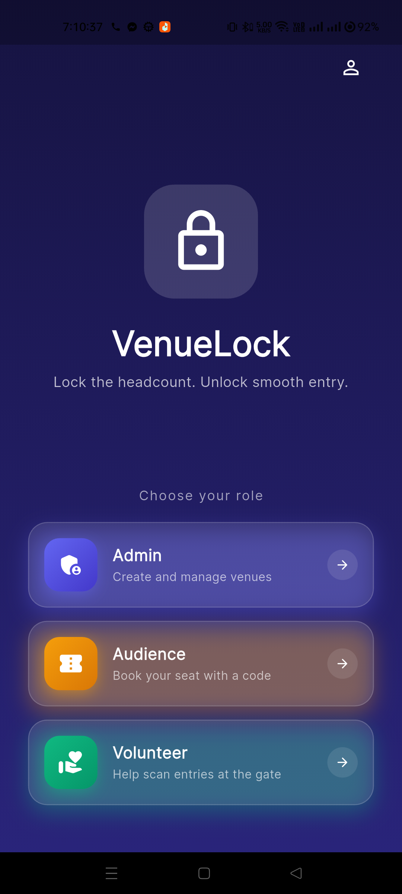
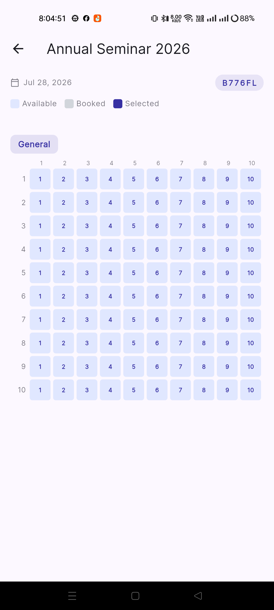
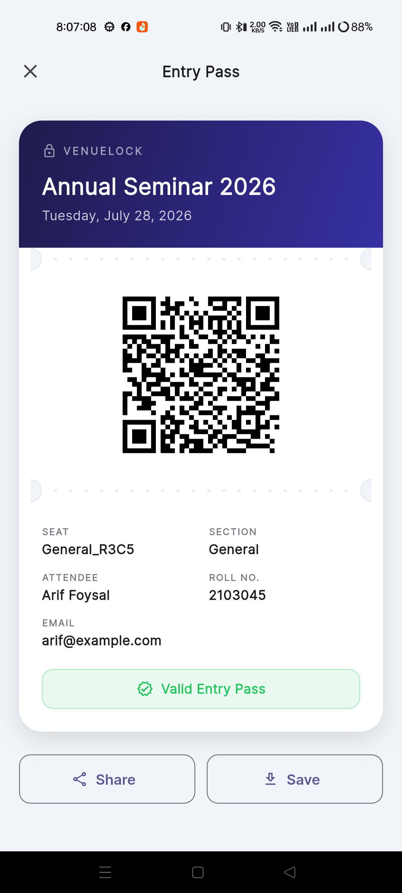
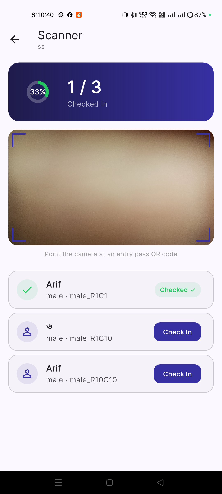

<div align="center">


# VenueLock

**Lock the headcount. Unlock smooth entry.**

Cap event attendance at an exact seat count — book by seat, hand out QR entry
passes, and check people in live with a phone camera. No overbooking, no
clipboard.

[](https://flutter.dev)
[](ARIF%28VL%29)
[](https://developer.bdapps.com)
[](LICENSE)

[**🌐 Live demo**](https://theobsidianeye-arif-foysal.github.io/Venue-Lock-v1/) ·
[**📱 Download APK**](https://github.com/TheObsidianEye-ARIF-FOYSAL/Venue-Lock-v1/releases/latest/download/VenueLock.apk) ·
[**📘 User manual**](docs/venuelock_user_guide.pdf) ·
[**📋 App details**](docs/venuelock_app_description.pdf)

</div>

---

## Why VenueLock

A venue has exactly *N* seats. Selling *N+1* tickets is a problem you only
discover at the door, with a queue behind it. VenueLock makes that impossible:
capacity is enforced by the server at the moment of booking, so the seat map is
the truth, not a spreadsheet someone forgot to refresh.

| | |
|---|---|
| 🎯 **Seat-exact** | Attendees pick a specific seat from a live map. `WHERE status = 'available'` decides who gets it — the UI is only a read model. |
| 🎫 **Passes that survive** | Every booking generates a QR entry pass, stored on-device. Force-close, restart, no signal — it still opens. |
| 📷 **Scan at the gate** | Admins and approved volunteers check people in with the phone's own camera, live across every device at the venue. |
| 🔐 **No shared logins** | Volunteers are approved per venue and scan with a device-scoped token, so nobody passes an admin password around at the door. |

## Screens

| Role picker | Seat map | Entry pass | Scanner |
|---|---|---|---|
|  |  |  |  |

## How it works

1. **An admin creates a venue** — names it, picks a date, and lays out one or
   more sections as rows × columns. Publishing fixes the capacity and mints a
   six-character access code.
2. **Attendees join with that code**, pick an open seat from the live map, and
   confirm. Booking a taken seat is impossible — the server decides.
3. **Each booking produces a QR entry pass** on the attendee's device.
4. **At the door**, admins or approved volunteers scan passes with the camera.
   Counts update live everywhere.

## The three roles

| Role | What they do |
|---|---|
| 🛡️ **Admin** | Create and configure venues, reserve seats for guests before doors open, review volunteer applications, scan at the door. |
| 🎫 **Audience** | Join with a venue code, book an exact seat, carry the entry pass on-device. |
| 📷 **Volunteer** | Apply to one venue with its access code, get approved, scan passes with a device-scoped token. |

## Tech stack

**App** — Flutter, with `provider` for state, `go_router` for navigation,
`mobile_scanner` for camera QR scanning, `qr_flutter` for generating passes,
and `SharedPreferences` for on-device persistence of the profile, saved
passes, and volunteer session. On desktop web the app renders inside a
`device_preview` phone frame; phones and native builds run full-screen.

**Backend** — plain PHP with SQLite, no framework, deployed by copying files
to a shared host. Session-token auth for admins, per-device tokens for
volunteers. OTP delivery runs through the BDApps carrier SMS/USSD SDK
vendored alongside the endpoints.

**Landing page** — static HTML/CSS/JS, no build step, published to GitHub
Pages beside the Flutter web build.

## Repo layout

```
app/          Flutter app (Android · iOS · Web · Windows) — the product
ARIF(VL)/     PHP + SQLite REST backend, deployed to ruetandroiddevelopers.com
landing/      Static landing page + published PDFs, deployed via GitHub Pages
docs/         Project overview, store copy, and the generated PDFs
.github/      CI: web deploy to Pages, tagged APK releases
```

## Quickstart

```bash
cd app
flutter pub get
flutter run
```

The app talks to the already-deployed backend by default, so no local server
is needed. To point it somewhere else:

```bash
flutter run --dart-define=SERVER_BASE_URL=https://your-host.example/path
```

### Deploying the backend

Copy the `ARIF(VL)/*.php` files to the host. Credentials live in
`ARIF(VL)/bdapps_config.php` (gitignored — start from
`bdapps_config.example.php`).

> [!WARNING]
> `venuelock.db` lives in the same directory and holds every account and
> booking. Upload individual files rather than the whole folder, and keep the
> database out of reach of public HTTP.

### Building the docs

The PDFs are generated from LaTeX in `docs/report_VL_app/`:

```bash
cd docs/report_VL_app
pdflatex venuelock_user_guide.tex        # twice, for the table of contents
pdflatex venuelock_app_description.tex
```

Copy the results into `landing/` to publish them — `docs/` is the source of
truth, `landing/` holds the published copies.

## CI/CD

| Workflow | Trigger | What it does |
|---|---|---|
| `deploy-web.yml` | push to `main` touching `app/` or `landing/` | Builds the Flutter web app and assembles it with the landing page into one Pages site (landing at `/`, app at `/app/`). |
| `release-apk.yml` | version tag, or manual dispatch | Builds a release APK and publishes it to GitHub Releases, giving the landing page a stable `latest/download` link. |

## Docs

| Document | What's in it |
|---|---|
| [📘 User manual (PDF)](docs/venuelock_user_guide.pdf) | Step-by-step walkthrough with screenshots, for all three roles |
| [📋 App details (PDF)](docs/venuelock_app_description.pdf) | Feature list, roles, technology, store copy |
| [`docs/PROJECT_OVERVIEW.md`](docs/PROJECT_OVERVIEW.md) | Architecture, tech stack, security notes |
| [`API_USAGE.md`](API_USAGE.md) | Every app → backend call, mapped to its endpoint |
| [`app/AUTH_AND_SUBSCRIPTION.md`](app/AUTH_AND_SUBSCRIPTION.md) | Auth and subscription flow in detail |
| [`PROGRESS.md`](PROGRESS.md) | Running session log — read this first when resuming work |

## License

MIT-style with attribution — see [`LICENSE`](LICENSE).
